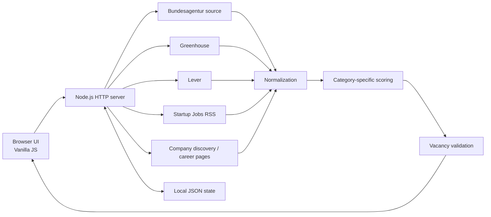

# Personal Job Agent

A **precision-first local job-search dashboard for Germany** built with Node.js and vanilla HTML/CSS/JavaScript.

The project started as a practical tool for managing a real job search. Its goal is not to maximize the number of listings shown, but to reduce noise, explain why a job matches, detect conflicting vacancy signals, and keep the application workflow organized.

> **Portfolio note:** this public version contains sample profile data only. Personal CV files, contact details, and application history are intentionally excluded.

## Why I built it

Job searches across multiple sources can produce duplicates, stale links, inconsistent vacancy states, and rankings that reward keyword quantity instead of actual fit. Personal Job Agent explores a different approach: normalize listings from different sources, score them with category-specific rules, validate whether a vacancy still appears current, and expose the evidence behind the result.

## Core features

- Searches jobs from the German Federal Employment Agency source.
- Supports multiple search profiles and locations.
- Adds direct company-career sources such as Greenhouse and Lever.
- Can discover company career pages and known ATS platforms.
- Supports a separate delivery-job fit model instead of reusing the tech-job scorer.
- Normalizes results from heterogeneous sources into a common job shape.
- Removes duplicates and keeps local application states such as saved, applied, and ignored.
- Analyses German-language requirements and highlights likely B2+/strong-German requirements.
- Generates a **reviewable application draft** from the job description and configured skills.
- Does **not** automatically send applications.
- Validates job availability using multiple signals and exposes confidence/evidence instead of silently treating every broken external link as an expired job.

## Junior-fit intelligence in v1.10

v1.10 adds an explainable seniority/experience layer on top of the precision-first matching model:

- Treats Junior, Entry-Level, Berufseinsteiger, Quereinsteiger and Trainee language as positive entry signals.
- Recognizes when first practical experience can be supported by open-source or project work.
- Detects side-project/open-source acceptance and learning/mentoring language.
- Penalizes Senior/Lead and 3+ year professional-experience thresholds for a Junior profile.
- Produces action-oriented decisions: **Apply now**, **Consider**, **Skill gap**, or **Skip for now**.
- Keeps the public portfolio profile generic; personal profiles stay local.

## Precision-first changes in v1.9

A major lesson from earlier versions was that a broken external apply link is not sufficient evidence that a vacancy is closed. In v1.9:

- HTTP 404/410 on an external apply link does not automatically mark a Federal Employment Agency listing as expired.
- Current presence in the source is treated as strong evidence that the listing still exists.
- Conflicting signals are shown as **Conflict / needs review**.
- Validation results include an evidence trail and confidence level.
- “Open only” means positively verified open/current-source jobs, not simply jobs that are “not known to be closed”.
- Tech and delivery scoring use different fit logic.

## Architecture



More detail: [`docs/ARCHITECTURE.md`](docs/ARCHITECTURE.md)

## Tech stack

- **Runtime:** Node.js 18+
- **Backend:** Node.js built-in HTTP/file-system APIs
- **Frontend:** HTML, CSS, vanilla JavaScript
- **Persistence:** local JSON files
- **External sources:** German Federal Employment Agency, Greenhouse, Lever, Startup Jobs RSS, discovered career pages / ATS links
- **No third-party npm dependencies** in the current version

## Run locally

```bash
npm start
```

Or use the convenience launchers included in v1.10:

- Windows: double-click `start-windows.bat`
- Linux/macOS: run `./start-linux.sh`

Then open:

```text
http://localhost:3000
```

Run a syntax check with:

```bash
npm run check
```

## Configuration

`config.json` contains search definitions. `cv-profile.json` in this public repository contains **sample data only**. Replace it locally with your own profile and keep private CV documents outside the repository.

A search entry looks like this:

```json
{
  "name": "Frontend - Munich",
  "query": "Frontend Developer",
  "location": "München",
  "radiusKm": 50,
  "publishedWithinDays": 30,
  "category": "tech"
}
```

## Engineering topics demonstrated

This project is useful to discuss in an interview because it contains more than a UI: source integration, normalization, heuristics, duplicate handling, validation, local persistence, async network work, error handling, scoring trade-offs, and a real example of correcting a false assumption in earlier versions.

See [`docs/INTERVIEW_PREP.md`](docs/INTERVIEW_PREP.md) for questions and answers based on the actual codebase.

## Real-world validation

The tool has been used during a real job search and surfaced an opportunity that progressed into onboarding/contract-preparation steps. This repository **does not claim that the algorithm “got a job”**. A future case study should describe only verifiable stages and outcomes. See [`docs/CASE_STUDY.md`](docs/CASE_STUDY.md).

## Privacy

- No user account or external application database is required.
- Application state is stored locally in JSON.
- The public repository must not contain a real CV, address, phone number, email address, or personal application history.
- Generated application drafts must always be reviewed before sending.

## Current limitations

- Matching and language classification are heuristic, not ML-based semantic matching.
- Career-page discovery can fail when sites require heavy client-side rendering or anti-bot protection.
- External APIs and page formats may change.
- The application-draft generator is intentionally conservative and requires human review.
- The current server is a single-file implementation and would benefit from modularization and automated tests.

## Roadmap

- Split the backend into source, normalization, scoring, validation, and persistence modules.
- Add unit tests for pure scoring/classification functions.
- Add fixture-based tests for source normalization.
- Add configurable scoring profiles instead of hard-coded preferences.
- Improve semantic fit analysis while keeping an explainable evidence trail.
- Add screenshots and a short demo GIF/video.
- Add export/import for local application state.

## Learning project

Personal Job Agent is intentionally both a **portfolio project** and a **learning project**. The goal is to understand and be able to explain every major design decision rather than only publishing generated code.

Start with [`docs/LEARNING_GUIDE.md`](docs/LEARNING_GUIDE.md).

## License

MIT
